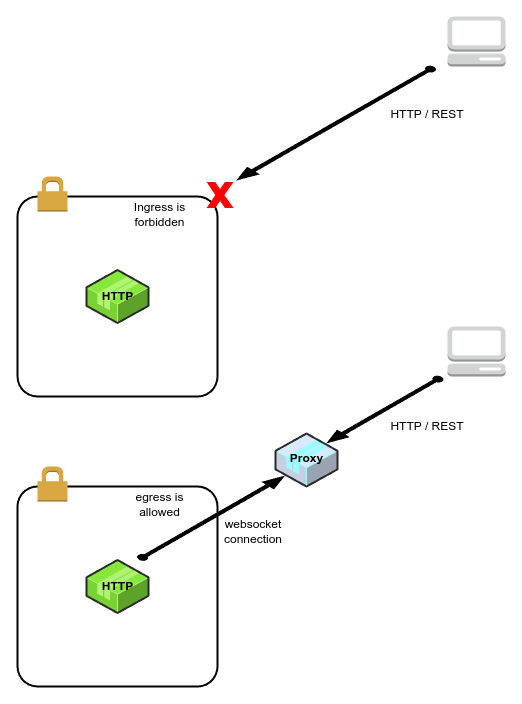

# backstream

[](https://github.com/grepplabs/backstream/releases)
[](https://opensource.org/licenses/Apache-2.0)


## Overview
The backstream is a library designed for environments with restricted ingress connections.
It enables HTTP servers to establish outbound WebSocket connections to a central HTTP service.
Once connected, users can send HTTP requests to the central service, which efficiently forwards them downstream to the
appropriate WebSocket-enabled servers, effectively bypassing ingress restrictions.

<p style="text-align: center;"></p>

## Usage

Write a `proxy` server.

```go
package main

import (
	"context"
	"flag"
	"log/slog"
	"net/http"
	"os"
	"time"

	"github.com/grepplabs/backstream/handler"
	"github.com/grepplabs/backstream/ws"
)

func main() {
	addr := flag.String("addr", ":8080", "Listen address")
	flag.Parse()

	codec := handler.NewHttpProtoCodec()
	proxyHandler := handler.NewProxyHandler(codec, handler.WithProxyDefaultRequestTimeout(3*time.Second))
	logger := slog.New(slog.NewJSONHandler(os.Stderr, &slog.HandlerOptions{Level: slog.LevelDebug}))
	serve := ws.NewServe(context.Background(), proxyHandler, codec.MessageCodec(), ws.WithServeLogger(logger), ws.WithRequireClientId(true))

	mux := http.NewServeMux()
	mux.HandleFunc("/ws", func(w http.ResponseWriter, r *http.Request) {
		serve.HandleWS(w, r)
	})
	mux.HandleFunc("/", func(w http.ResponseWriter, r *http.Request) {
		serve.HandleProxy(w, r)
	})
	server := &http.Server{
		Addr:              *addr,
		ReadHeaderTimeout: 3 * time.Second,
		Handler:           mux,
	}
	if err := server.ListenAndServe(); err != nil {
		logger.Error(err.Error())
	}
}
```

Write a `HTTP service` server.

```go
package main

import (
	"context"
	"flag"
	"log/slog"
	"net/http"
	"os"

	"github.com/grepplabs/backstream/handler"
	"github.com/grepplabs/backstream/ws"
)

func main() {
	addr := flag.String("addr", ":8081", "Listen address")
	proxyUrl := flag.String("proxy-url", "ws://localhost:8080/ws", "Proxy websocket endpoint")
	clientID := flag.String("client-id", "4711", "Client ID")
	flag.Parse()

	codec := handler.NewHttpProtoCodec()
	logger := slog.New(slog.NewJSONHandler(os.Stderr, &slog.HandlerOptions{Level: slog.LevelDebug})).With(slog.String("client-id", *clientID))
	mux := http.NewServeMux()
	wsHandler := handler.NewRecoveryHandler(handler.NewHTTPHandler(func(w http.ResponseWriter, r *http.Request) {
		mux.ServeHTTP(w, r)
	}, codec), logger)
	client := ws.NewClient(context.Background(), *proxyUrl, wsHandler, codec.MessageCodec(), ws.WithClientLogger(logger), ws.WithClientID(*clientID))
	client.Start()

	mux.HandleFunc("/test", func(w http.ResponseWriter, r *http.Request) {
		w.WriteHeader(200)
	})
	server := &http.Server{
		Addr:    *addr,
		Handler: mux,
	}
	if err := server.ListenAndServe(); err != nil {
		logger.Error(err.Error())
	}
}
```

Invoke `test` endpoint against the `proxy` server.

```bash
curl -v -H 'x-backstream-client-id: 4711' http://localhost:8080/test
curl -v -H 'x-backstream-client-id: 4711' -H 'x-backstream-request-timeout: 12s' http://localhost:8080/test
```
